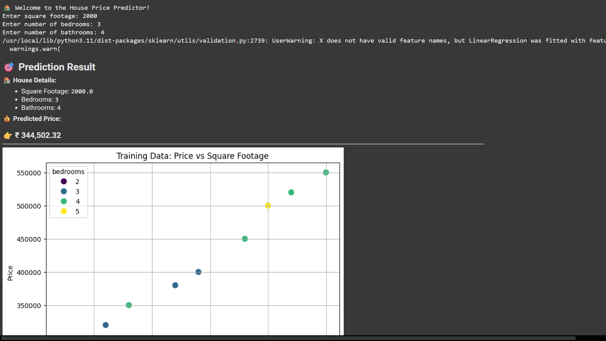

# PRODIGY_ML_01
A beginner-friendly machine learning project that predicts house prices based on features like area, number of bedrooms, and location. Built using Python and scikit-learn, this notebook demonstrates data preprocessing, model training, and visualization — all in one place!
# 🏡 House Price Predictor

This project uses a simple linear regression model to predict house prices based on square footage, number of bedrooms, and bathrooms.

## 📦 Features

- Interactive user input
- Markdown-styled output
- Scatter plot visualization of training data
- Easy to run in Google Colab

## 📸 Output Screenshot



## 🚀 Run in Google Colab

Click the badge below to open and run the notebook directly in Google Colab:

[](https://colab.research.google.com/github/BandiralaJahnavi/PRODIGY_ML_01/blob/main/houseprice_predictor.ipynb)

> Replace `YOUR_USERNAME` with your actual GitHub username after uploading.

## 📁 Dataset

The sample dataset is located in `data/sample_data.csv`.

---

## 📊 Visualization

The notebook includes a scatter plot showing the relationship between square footage and price, colored by number of bedrooms.

---

## 🛠 Requirements

Install dependencies using:

```bash
pip install -r requirements.txt
